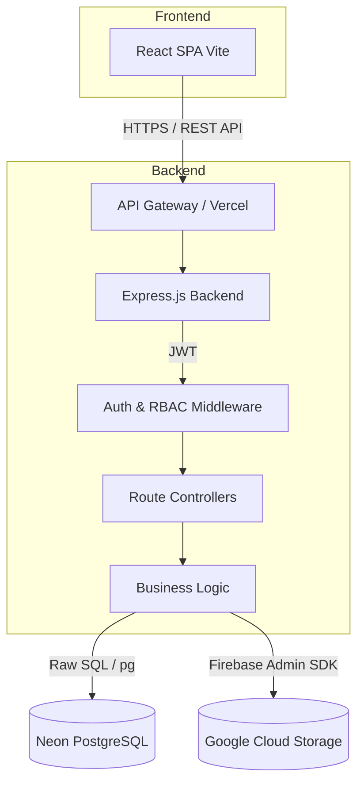
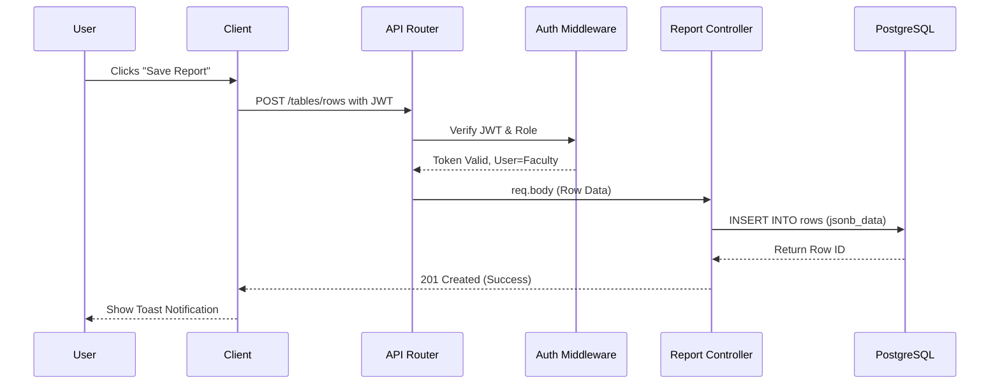

# 01 Architecture Documentation

## System Architecture Overview

The VNR Reports platform follows a decoupled Client-Server architecture. The frontend is a statically hosted Single Page Application (SPA), while the backend is a stateless RESTful API designed to run in serverless environments (like Vercel or Firebase Functions). The database is a managed PostgreSQL instance on Neon, and object storage is delegated to Google Cloud Storage (GCS).

## Layers of the Backend Architecture

1. **Routing Layer (`/routes`)**: Maps HTTP methods and endpoints to specific controller functions. Also applies middleware (like `authenticateToken`, `requireAdmin`).
2. **Middleware Layer (`/middleware`)**: Intercepts requests for authentication validation, role authorization, rate limiting, and request logging.
3. **Controller Layer (`/controllers`)**: Handles HTTP request parsing, response formatting, and HTTP status codes. It delegates the actual heavy lifting to the Services layer.
4. **Service Layer (`/services` - implicit or merged in controllers)**: Contains the core business logic (e.g., consolidating reports, generating snapshots, hashing passwords).
5. **Data Access Layer (`/sql`, `pg` driver)**: Executes SQL queries against the PostgreSQL database.

## Key Engineering Decisions & Tradeoffs

### 1. JSONB for Dynamic Report Data
**Decision**: Instead of creating a unique SQL table for every type of report (e.g., Publications, Events, Classes), the system uses a core `reports` or `tables` structure where the row data is stored in a `JSONB` column.
**Tradeoff**: 
* *Pros*: Extremely flexible. Adding a new column to a report table on the frontend doesn't require a backend database migration.
* *Cons*: Harder to write complex relational queries or aggregations purely in SQL without complex JSONB operators.

### 2. Serverless Readiness
**Decision**: The Express app is exported as a single module (`export default app`) without calling `app.listen()` directly inside `app.ts`. `index.ts` handles the local listening, while `firebaseIndex.ts` wraps the app for Firebase Functions.
**Tradeoff**:
* *Pros*: Deployable anywhere (Vercel, Firebase, AWS Lambda, standard Node VPS). High scalability.
* *Cons*: Cold starts might occur depending on the serverless provider. Background processes (long-running jobs) are difficult and require webhooks or queues.

### 3. Client-Side Routing and Lazy Loading
**Decision**: The React frontend uses React Router with `React.lazy()` for route-level code splitting.
**Tradeoff**:
* *Pros*: Initial load time is drastically reduced because the user only downloads the JavaScript for the login page and core layout first.
* *Cons*: Slight delay when navigating to a new route for the first time while the chunk is fetched.

## Request Lifecycle (Example: Submit Report)

## Authentication Flow

1. **Login**: User POSTs email/password to `/auth/login`.
2. **Verification**: Backend checks password via `bcrypt`.
3. **Token Generation**: Backend signs a JWT payload containing `userId`, `role`, and `department`.
4. **Storage**: Frontend receives JWT and stores it in `localStorage` (via Axios interceptor or Context).
5. **Subsequent Requests**: Frontend attaches `Authorization: Bearer <token>` to all API calls.

## Database Interaction

The backend uses raw SQL queries via the `pg` library rather than an ORM like Prisma or TypeORM.
* **Why raw SQL?** It provides maximum control over complex queries, particularly when dealing with PostgreSQL specific features like `JSONB` and ensuring optimal performance without ORM abstraction overhead.
