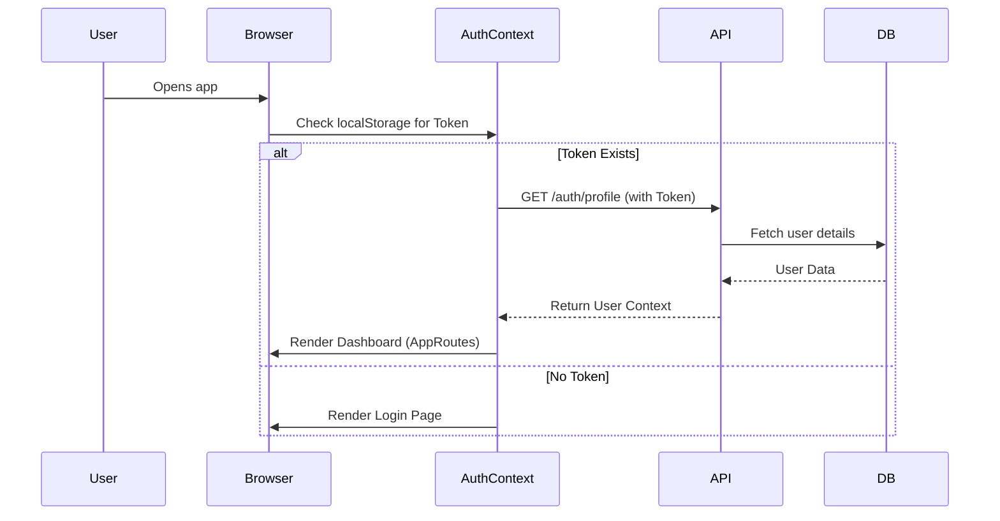

# 04 Data Flow

This document traces how data moves through the application, focusing on key interactions between the user, frontend state, network, backend API, and database.

## 1. Initial State & Authentication Flow

When a user opens the application, the following flow occurs to establish identity:



**Implementation Details:**
* The `AuthContext` wraps the entire application. It controls rendering; if `loading` is true, a spinner shows.
* The API uses `axios` interceptors (`client/src/libs/api.ts`) to automatically append the `Authorization: Bearer <token>` header to every outgoing request.

## 2. Dynamic Table Rendering Flow

The core feature of the app is displaying different tables based on the selected section (e.g., "Guest Lectures", "Publications").

1. **User Action**: User clicks a section in the Sidebar.
2. **Context Update**: The URL changes (`/section/:sectionKey`). `ReportEditor` component reads the `:sectionKey` param.
3. **Fetch Schema**: Frontend calls `GET /sections/:sectionKey/schema`.
   * Backend looks up the metadata for this section (column names, data types).
   * Backend returns JSON schema.
4. **Fetch Data**: Frontend calls `GET /tables/:sectionKey/rows` (filtered by Global Month/Year context).
   * Backend queries the `rows` table using Postgres `JSONB` where clauses based on user ID and month.
5. **Render**: Frontend parses the schema and renders an HTML Table. The data rows map to the columns defined in the schema.

## 3. Data Entry & Save Flow

When a faculty member adds a new row to a table:

1. **Local State**: The user types into an input field. React state updates locally.
2. **Save Action**: User clicks "Save".
3. **Payload Construction**: Frontend constructs a JSON object representing the row.
   ```json
   {
     "sectionKey": "publications",
     "month": "02",
     "year": "2026",
     "rowData": { "title": "AI in Ed", "journal": "IEEE", "date": "2026-02-10" }
   }
   ```
4. **Network Request**: `POST /tables/rows`
5. **Backend Processing**:
   * `auth.middleware` validates user.
   * `table.controller` receives the request.
   * Controller executes raw SQL: `INSERT INTO rows (user_id, section_key, month, year, data) VALUES ($1, $2, $3, $4, $5) RETURNING id`. (Where `$5` is the `rowData` JSON object).
6. **Response**: Backend returns `201 Created` with the new Row ID.
7. **UI Update**: Frontend updates the local table state to include the new row and its database ID, removing the need to re-fetch the entire table.

## 4. Admin Snapshot Generation Flow

This is a heavy, read-intensive flow.

1. **Admin Action**: Clicks "Generate Monthly Snapshot" for "February 2026".
2. **Network Request**: `GET /reports/snapshot?month=02&year=2026`.
3. **Backend Processing**:
   * The backend must aggregate data across *all* users and *all* sections for that month.
   * It executes a complex `JOIN` query, pulling user info, department info, and all `JSONB` row data.
   * The logic iterates through the result set, grouping rows by Department, then by Section.
4. **Export**: 
   * The backend uses `exceljs` or `docx` libraries to map this massive JSON structure into an Excel spreadsheet or Word Document buffer in memory.
5. **Response**: The server sets headers `Content-Disposition: attachment; filename="report.xlsx"` and streams the binary buffer to the client.
6. **Client Download**: The browser intercepts the blob response and triggers a file download.

## Concurrency and Race Conditions
Because state is managed at the row level via JSONB, if two admins edit different rows simultaneously, there are no conflicts. However, if two people edit the *same* row, the last `PUT/PATCH` request overwrites the `JSONB` cell in Postgres.
