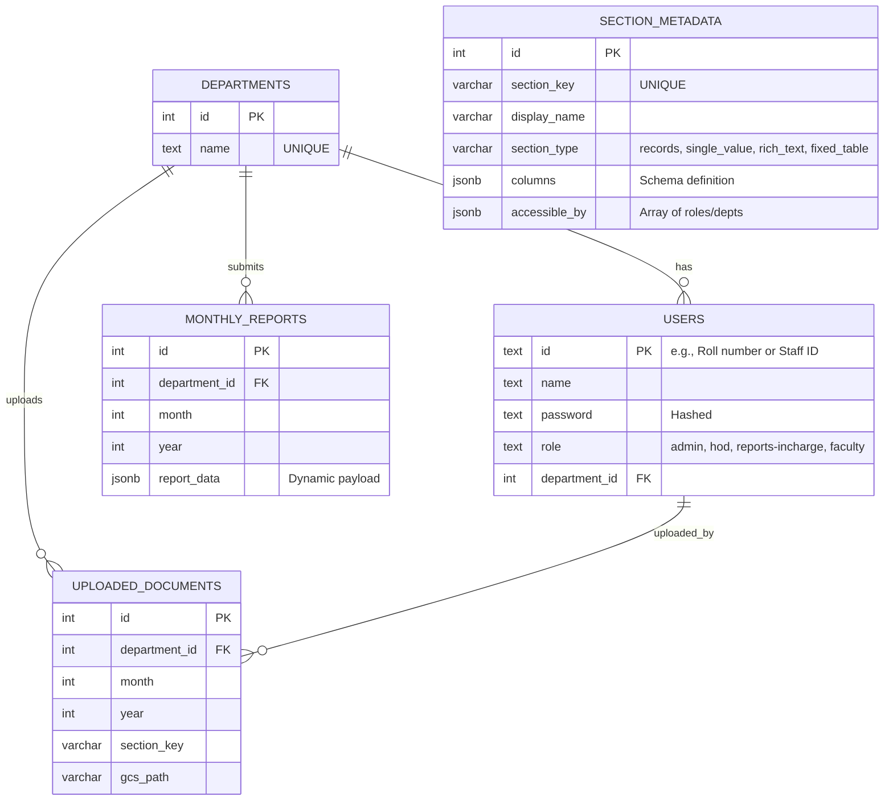

# 07 Database Design

The system relies on PostgreSQL hosted on Neon. The core philosophy of the database design is a hybrid approach: strict relational rules for Identity and Access Management (IAM), but NoSQL-like `JSONB` flexibility for the actual report data.

## ER Diagram



## Deep Dive into Tables

### 1. `users` and `departments`
Standard relational tables. 
* `users.role` has a `CHECK` constraint limiting it to `('admin','hod','reports-incharge','faculty')`.
* Passwords are encrypted via `bcrypt`. 
* `department_id = 0` is often used for "TEST" or Admin pseudo-departments.

### 2. `section_metadata` (The Schema Engine)
This table drives the entire frontend UI dynamically.
* `section_key`: Unique string identifier (e.g., `journal_publications`).
* `section_type`: Dictates UI layout (`records` = tables with rows, `rich_text` = Tiptap editor, `single_value` = single form).
* `columns` (JSONB): An array of JSON objects defining the inputs.
  ```json
  [
    {"name": "faculty_info", "display_name": "Faculty Name", "type": "TEXTAREA", "required": true},
    {"name": "impact_factor", "display_name": "Impact Factor", "type": "NUMBER"}
  ]
  ```
* `accessible_by`: Array like `["academic", "dept:MTP"]` defining who can view/edit this section.

### 3. `monthly_reports` (The Data Store)
The system aggregates data per department, per month, per year.
* `UNIQUE(department_id, month, year)` constraint ensures only one unified report document exists per department/month.
* `report_data` (JSONB): This column stores the actual payload. A single cell here might look like:
  ```json
  {
    "journal_publications": [
       {"id": 1, "faculty_info": "Dr. Smith", "impact_factor": 2.5},
       {"id": 2, "faculty_info": "Dr. Doe", "impact_factor": 1.1}
    ],
    "dept_achievements": "<p>We won an award.</p>"
  }
  ```

### Why JSONB for `monthly_reports`?
If we mapped every section (Publications, Events, Patents) to standard SQL tables, adding a new requirement (like "Add a column for 'ISSN Number' to Publications") would require:
1. Writing a SQL `ALTER TABLE` migration.
2. Updating Backend TS interfaces.
3. Updating Frontend UI.

With JSONB + `section_metadata`, the Admin just updates the JSON `columns` array in `section_metadata` directly in the database. The frontend instantly renders the new input field, and the new data is blindly saved into the `report_data` JSONB payload.

### Indexing Strategies
To prevent slow queries on the JSONB payloads:
* `idx_monthly_reports_lookup`: B-Tree index on `(department_id, year, month)` because all GET requests filter by these first.
* `idx_monthly_reports_data`: GIN Index on `report_data` `USING GIN (report_data)`. This allows fast searching *inside* the JSON payload (e.g., finding all publications across all departments where a specific faculty name is mentioned).
