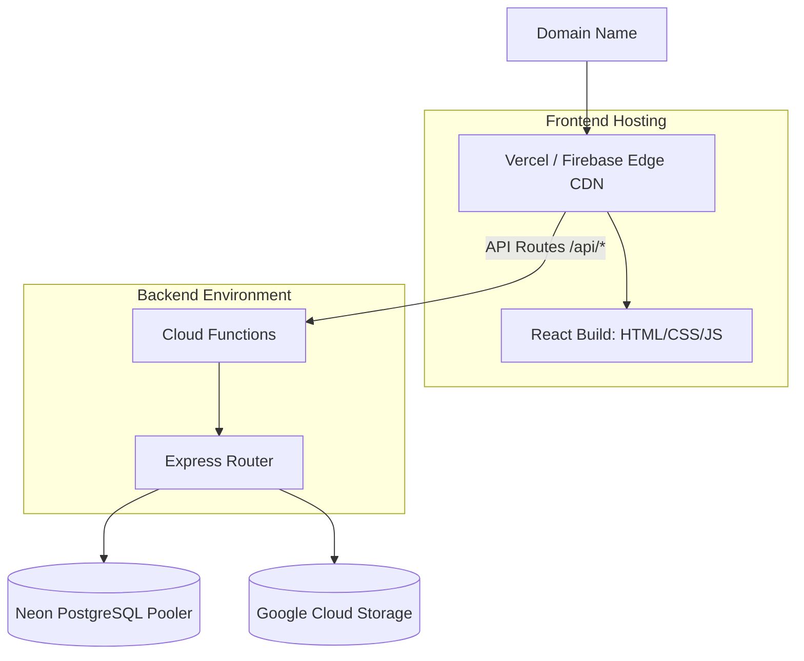

# 12 Deployment Architecture

The VNR Reports platform is designed to be highly portable, but it is optimized for modern cloud-native, serverless environments.

## Current Setup Overview

1. **Frontend**: Statically built React SPA. (Deployed to Vercel, Firebase Hosting, or Netlify).
2. **Backend**: Express REST API. (Configured for Firebase Cloud Functions or Vercel Serverless).
3. **Database**: PostgreSQL hosted on Neon (Serverless Postgres).
4. **Storage**: Google Cloud Storage (GCS) via Firebase Admin.

## Step-by-Step Deployment Process

### Frontend Deployment (e.g., Vercel)
1. Push code to GitHub.
2. Connect Vercel to the repository.
3. Set the Root Directory to `client/`.
4. Build Command: `npm run build` (which runs `tsc -b && vite build`).
5. Output Directory: `dist`.
6. Environment Variables: Set `VITE_API_URL` to point to the production backend URL.
7. *Routing*: Vercel (or any static host) must be configured to redirect all 404s to `index.html` to allow React Router to handle client-side routing.

### Backend Deployment (Firebase Functions)
The backend codebase includes specific setups for Firebase.
1. `firebaseIndex.ts` imports the Express `app` and exports it as a Firebase HTTPS function.
2. `firebase.json` defines the hosting and function configuration.
3. Build Step: `npm run build` compiles TypeScript from `src/` to `dist/`.
4. Deploy Step: `firebase deploy --only functions`.
5. Environment Variables: Set via Google Cloud Secret Manager or Firebase environment config.

## Handling the Database (Neon)
Neon is a serverless Postgres provider. It separates compute from storage.
* **Connection Pooling**: Because Serverless functions spin up and down constantly, they can quickly exhaust a database's concurrent connection limit. Neon provides a `Pooler URL` (usually port 5432 with `?options=project%3D...`). The backend `env.PG_CONN_STRING_PROD` MUST use this pooler URL, not the direct connection URL.

## Continuous Integration / Continuous Deployment (CI/CD)
The project includes a `cloudbuild.yaml` (Google Cloud Build) and potentially GitHub Actions configurations.
* A push to the `main` branch triggers the build pipeline.
* The pipeline installs dependencies, runs TypeScript compilation (`tsc`), and deploys the assets to the respective cloud providers.
